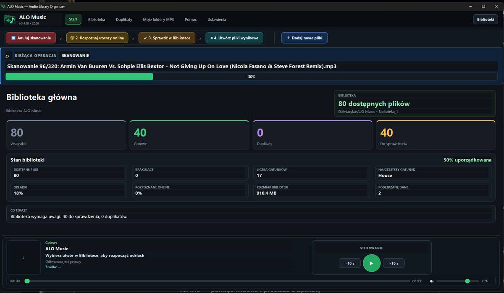
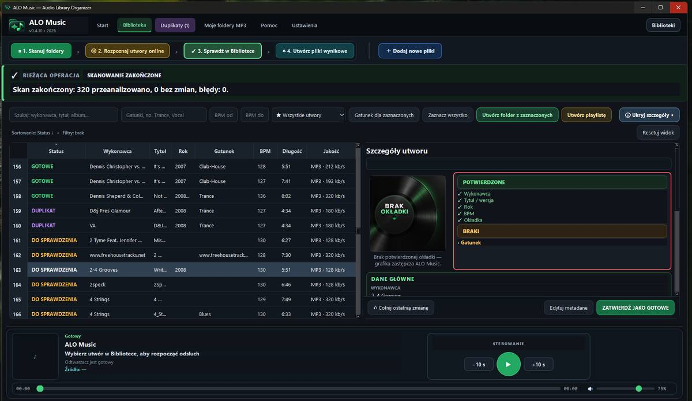
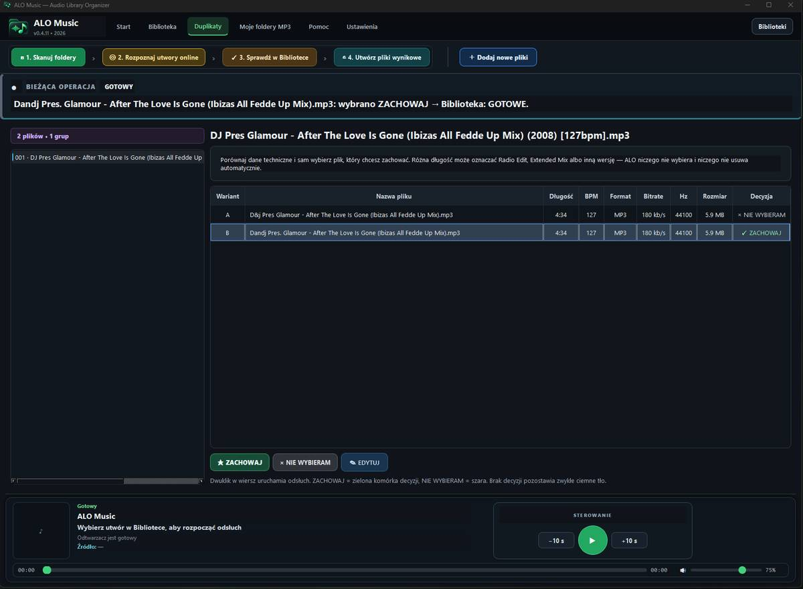
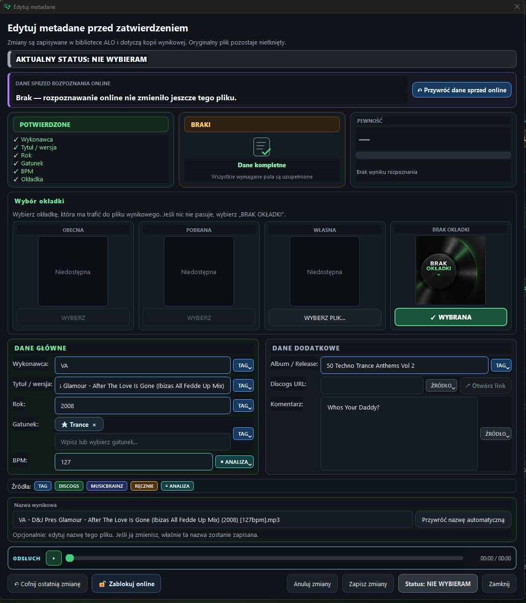

#  ALO Music — Audio Library Organizer

**ALO Music** to desktopowa aplikacja dla Windows do bezpiecznego porządkowania dużych bibliotek muzycznych. Skanuje lokalne foldery, analizuje pliki audio i metadane, pomaga rozpoznawać utwory online, porównuje potencjalne duplikaty i tworzy uporządkowane pliki wynikowe — bez ingerowania w oryginały.

**Aktualna wersja: 0.4.15** · Windows · interfejs PL / EN · projekt aktywnie rozwijany

**[Zobacz pełne wydanie ALO Music v0.4.15](https://github.com/DamianPPD/ALO-Music-Public/releases/tag/v0.4.15)**

> **Najważniejsza zasada ALO:** pliki źródłowe pozostają nietknięte. Program pracuje na indeksie biblioteki i tworzy osobne kopie wynikowe.

## Pobieranie

Gotowe wydania dla Windows są publikowane w sekcji **Releases** tego repozytorium.

Każde wydanie zawiera:

- instalator `ALO-Music-v0.4.15-Setup.exe`,
- wersję Portable `ALO-Music-v0.4.15-Windows-Portable.zip`,
- plik `SHA256SUMS.txt` do weryfikacji integralności pobranych plików.

Kod źródłowy ALO Music pozostaje prywatny i nie jest częścią tego repozytorium ani paczek publicznych.

## Co nowego w v0.4.15

- uproszczony ekran **Start** bez powielonych przycisków skanowania, rozpoznawania online i duplikatów,
- nowa sekcja **Statystyki biblioteki**: okładki, rozpoznane online, brakujące pliki, podejrzane dane, rozmiar biblioteki i wolne miejsce,
- numer wersji programu widoczny na ekranie uruchamiania,
- grubszy i wygodniejszy pasek postępu odtwarzacza,
- klikalne kafelki Startu prowadzące do odpowiednich widoków Biblioteki i Duplikatów,
- zapamiętywana informacja o ostatnim skanowaniu,
- czytelne wyróżnienie aktualnie odtwarzanego utworu bez zmiany kolejności listy,
- poprawki rozpoznawania tytułów i wykonawców oraz odróżnienie braku dopasowania od błędu usług online,
- zachowanie pozycji i kolejności Biblioteki po zmianie statusu utworu,
- stabilniejsza obsługa odsłuchu A/B i rozpoznawania pojedynczego utworu.

## Co potrafi ALO Music

- skanowanie dużych folderów z muzyką i budowanie lokalnej biblioteki,
- rozpoznawanie nagrań i uzupełnianie danych z **AcoustID, MusicBrainz i Discogs**,
- rozpoznawanie online całej biblioteki albo pojedynczego utworu z edytora metadanych,
- analiza BPM oraz kontrola podstawowych danych technicznych pliku,
- edycja wykonawcy, tytułu / wersji, roku, gatunku, BPM, albumu, komentarza i okładki,
- czytelne statusy: **GOTOWE**, **DUPLIKAT**, **DO SPRAWDZENIA** i **NIE WYBIERAM**,
- ręczne porównywanie duplikatów bez automatycznego wybierania „lepszego” pliku,
- odsłuch A/B potencjalnych duplikatów z zachowaniem pozycji utworu,
- rozróżnianie wersji takich jak Radio Edit, Extended Mix, Original Mix, Club Mix i remix,
- blokowanie wybranego utworu przed ponownym rozpoznawaniem online,
- wyszukiwanie, filtrowanie i sortowanie biblioteki,
- wbudowany odsłuch oraz kolejkę „odtwórz jako następny”,
- tworzenie playlist M3U8,
- obsługę wielu bibliotek i własnych folderów MP3,
- bezpieczne tworzenie uporządkowanych plików wynikowych bez automatycznego kasowania muzyki.

## Prosty przepływ pracy

**1. Skanuj foldery → 2. Rozpoznaj utwory online → 3. Sprawdź w Bibliotece → 4. Utwórz pliki wynikowe**

ALO prowadzi użytkownika przez cały proces jednym paskiem etapów. Po skanowaniu od razu widać, ile utworów wymaga sprawdzenia, czy wykryto potencjalne duplikaty i jaki jest stan całej biblioteki.

## Zrzuty ekranu

### Start — stan biblioteki i szybkie statystyki

Ekran Start pokazuje aktywną bibliotekę, najważniejsze liczniki oraz kompaktowe statystyki dotyczące okładek, rozpoznania online, brakujących plików, podejrzanych danych, rozmiaru biblioteki i wolnego miejsca.

### Biblioteka — wyszukiwanie, statusy i szczegóły utworu

Biblioteka łączy dużą tabelę utworów z wyszukiwaniem, filtrami, danymi technicznymi i panelem szczegółów. Aktualnie odtwarzany utwór jest wyróżniony, a zmiana statusu nie powoduje niechcianego przeskakiwania listy.

### Duplikaty — decyzję podejmuje użytkownik

ALO zestawia potencjalnie podobne pliki i pokazuje m.in. długość, BPM, format, bitrate, częstotliwość próbkowania oraz rozmiar. Program **nie wybiera automatycznie zwycięzcy** — użytkownik sam oznacza `ZACHOWAJ` albo `NIE WYBIERAM`.

Do porównania można używać odsłuchu **A/B**, który zachowuje bieżący moment utworu przy kolejnych przełączeniach.

### Edytor metadanych — wszystko w jednym miejscu

Edytor pozwala sprawdzić dane przed i po rozpoznaniu online, wybrać okładkę, poprawić metadane, sterować źródłami danych, odsłuchać utwór, zablokować ponowne rozpoznawanie i kontrolować nazwę pliku wynikowego.

## Integralność plików

Dla wydania v0.4.15 publikowany jest plik `SHA256SUMS.txt`.

Suma instalatora:

`42710e41d642272894209ecc77e12897f68a594607b7505d7f51722ac3035e76`

Suma wersji Portable:

`07343d80857805f40a5b075108c2193e7ac05b5827c0af27e665d1fe5649a8f2`

## Bezpieczeństwo danych

ALO Music został zaprojektowany tak, aby porządkowanie kolekcji nie oznaczało ryzyka utraty oryginałów. Źródłowe pliki muzyczne nie są modyfikowane ani automatycznie usuwane. Pliki wynikowe powstają jako osobne kopie, a decyzje dotyczące duplikatów i utworów odrzuconych zawsze należą do użytkownika.

## Rozpoznawanie online

ALO może korzystać z **AcoustID / Chromaprint**, **MusicBrainz** i **Discogs**. Połączenie z Internetem jest potrzebne do rozpoznawania i pobierania danych online; samo przeglądanie i porządkowanie lokalnej biblioteki pozostaje funkcją desktopową.

Wybrane utwory można zablokować przed kolejnym rozpoznaniem online, dzięki czemu ręcznie poprawione dane nie zostaną później przypadkowo zastąpione.

## Stan projektu

ALO Music jest aktywnie rozwijany. Obecna linia **v0.4.15** skupia się na czytelniejszym ekranie Start, praktycznych statystykach biblioteki, wygodniejszym odtwarzaczu, stabilności Biblioteki i bezpiecznej edycji metadanych.

---

**ALO Music — porządkuj bibliotekę, zachowując kontrolę nad każdym plikiem.**
